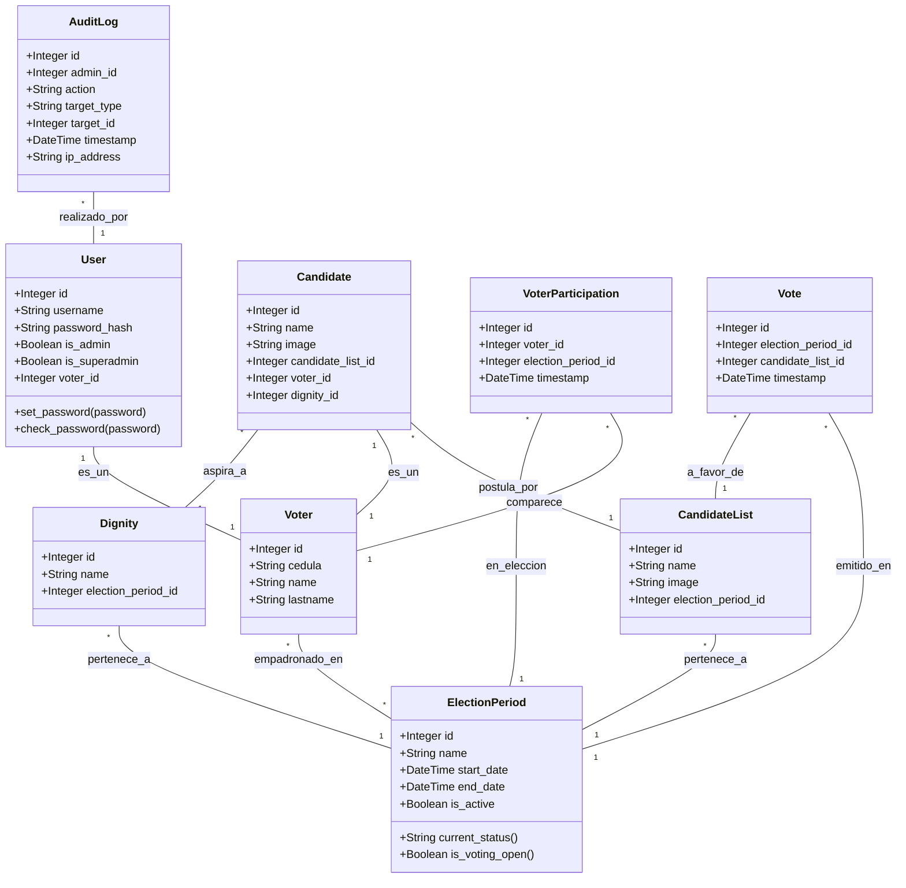

# Casos de Uso y Diagramas UML - Sistema de Votación ISTAE

Este documento proporciona una representación visual y estructural de la lógica de negocio y arquitectura del sistema de votación.

## 1. Diagrama de Casos de Uso (Use Case Diagram)

Este diagrama representa las interacciones principales de los dos actores principales del sistema: **Administrador / Super Admin** y **Votante (Estudiante)**.

```mermaid
usecaseDiagram
    actor "Votante (Estudiante)" as Voter
    actor "Administrador" as Admin
    actor "Super Administrador" as SuperAdmin

    %% Herencia de actores
    SuperAdmin --|> Admin

    %% Casos de Uso del Votante
    package "Plataforma de Sufragio" {
        usecase "Iniciar Sesión" as UC1
        usecase "Ver Elecciones Activas" as UC2
        usecase "Consultar Papeleta Electoral" as UC3
        usecase "Emitir Voto (Secreto)" as UC4
        usecase "Ver Resultados Oficiales" as UC5
    }

    Voter --> UC1
    Voter --> UC2
    Voter --> UC3
    Voter --> UC4
    Voter --> UC5

    %% Casos de Uso del Administrador
    package "Panel de Control" {
        usecase "Gestionar Periodos Electorales" as UC6
        usecase "Abrir/Cerrar Elección Manualmente" as UC7
        usecase "Subir Padrón Electoral (Excel/CSV)" as UC8
        usecase "Crear/Editar Listas (Partidos)" as UC9
        usecase "Definir Dignidades (Cargos)" as UC10
        usecase "Inscribir Candidatos a Listas" as UC11
        usecase "Visualizar Dashboard de Resultados" as UC12
        usecase "Descargar Acta PDF" as UC13
        usecase "Gestionar Usuarios (SuperAdmin)" as UC14
        usecase "Impersonar Usuarios (Login As)" as UC15
        usecase "Ver Registro de Auditoría" as UC16
        usecase "Gestionar y Restaurar Respaldos" as UC17
    }

    Admin --> UC1
    Admin --> UC6
    Admin --> UC7
    Admin --> UC8
    Admin --> UC9
    Admin --> UC10
    Admin --> UC11
    Admin --> UC12
    Admin --> UC13
    
    SuperAdmin --> UC14
    SuperAdmin --> UC15
    SuperAdmin --> UC16
    SuperAdmin --> UC17
```

---

## 2. Diagrama de Clases UML (Class Diagram)

A continuación se muestra la estructura relacional de la base de datos y cómo interactúan las entidades (Modelos SQLAlchemy).



## 3. Explicación de Patrones Críticos

### A. Voto Secreto y Anonimato
El diagrama ilustra cómo el sistema garantiza el voto secreto (requerido por ley).
- Cuando un estudiante vota, se crea un registro en **`VoterParticipation`**, que asocia su `voter_id` con el `election_period_id` (para evitar el doble voto).
- Al mismo tiempo, se crea un registro en **`Vote`**, que asocia únicamente el `election_period_id` con el `candidate_list_id`.
- **NO existe** ninguna relación en la base de datos entre `VoterParticipation` (quién votó) y `Vote` (qué eligió), asegurando un escrutinio blindado y anónimo.

### B. Máquinas de Estados (Propiedades Dinámicas)
La clase `ElectionPeriod` no tiene un simple estado estático, sino que su disponibilidad se calcula dinámicamente mediante las funciones `current_status()` y `is_voting_open()`. Estas comparan constantemente el tiempo del servidor (`datetime.utcnow()`) con `start_date` y `end_date`, cerrando y abriendo las urnas de forma automática.
