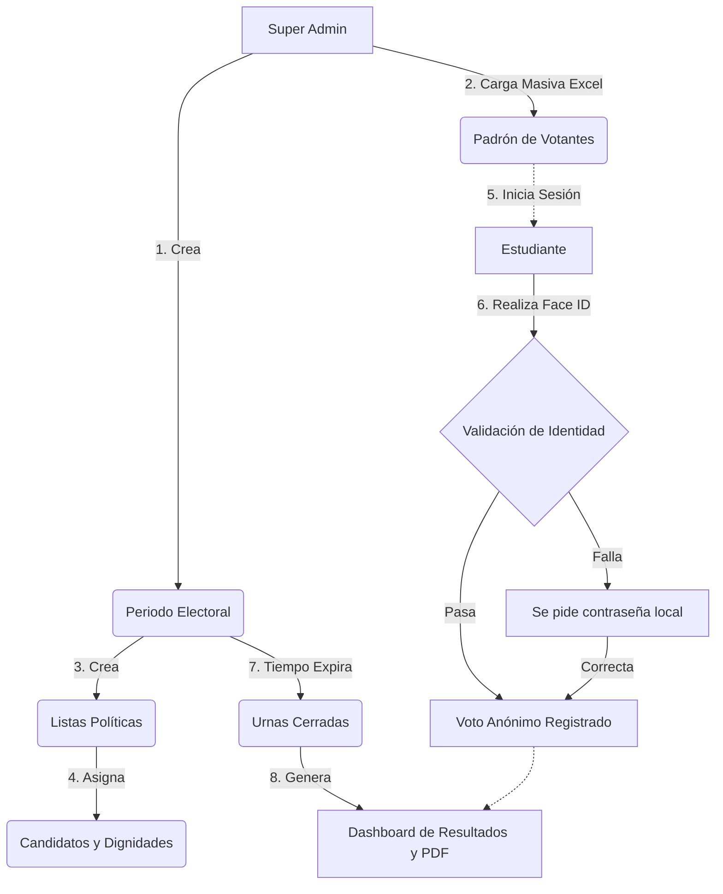

# 📖 Manual de Uso y Funcionalidades: Sistema de Votación ISTAE

¡Bienvenido al **Sistema de Votación Electrónica**! Este manual ilustrativo te guiará paso a paso por las funcionalidades del sistema, diseñado para ofrecer una experiencia moderna, segura y accesible tanto para votantes como para administradores.

---

## 🧭 Índice Interactivo

1. [👤 Para el Votante (Estudiante)](#1--para-el-votante-estudiante)
   - [Proceso de Sufragio con Biometría](#-proceso-de-sufragio-con-biometría-face-id)
   - [Resultados y Transparencia](#-resultados-y-transparencia)
2. [⚙️ Para el Administrador / Super Admin](#2--para-el-administrador--super-admin)
   - [Gestión de Periodos Electorales](#-gestión-de-periodos-electorales)
   - [Padrón Electoral y Carga Masiva](#-padrón-electoral-y-carga-masiva)
   - [Candidatos y Listas](#-candidatos-y-listas)
   - [Auditoría y Respaldos (DLP)](#-auditoría-y-respaldos-dlp)
3. [Flujo de Trabajo del Sistema](#3-flujo-de-trabajo-general)

---

## 1. 👤 Para el Votante (Estudiante)

El módulo de votación está optimizado para dispositivos móviles y computadoras de escritorio. Garantiza el anonimato absoluto de tu voto.

### 📸 Proceso de Sufragio con Biometría (Face ID)

El sistema utiliza Inteligencia Artificial en el navegador para validar tu identidad y prevenir suplantaciones, sin guardar fotos tuyas en ningún servidor (Zero-Trust).

1. **Ingreso Seguro:** Inicia sesión con tus credenciales institucionales.
2. **Selección de Papeleta:** Observa el panel principal. Verás las elecciones activas con un **reloj de cuenta regresiva** dinámico. Haz clic en "Ir a Votar".
3. **Elige tu Opción:** Visualiza todas las listas participantes, conociendo a sus candidatos. También tendrás las opciones obligatorias de **Voto Nulo** y **Voto en Blanco**.
4. **Validación Biométrica:**
   - Al seleccionar tu opción, se activará la cámara frontal.
   - Alinea tu rostro con el recuadro.
   - En milisegundos, la IA calculará la similitud geométrica con tu firma biométrica.
   - *¿No tienes cámara?* El sistema te pedirá ingresar tu contraseña como respaldo seguro (Fallback).
5. **Confirmación:** Tu voto se registra anónimamente y el sistema registra únicamente que has participado.

> [!TIP]
> **Consejo:** Asegúrate de estar en un lugar con buena iluminación antes de iniciar la validación biométrica para acelerar el proceso.

### 📊 Resultados y Transparencia

Una vez finalizado el tiempo exacto del periodo electoral, las urnas se cierran automáticamente.
- Dirígete a la sección **Resultados Oficiales**.
- Visualiza gráficos dinámicos y descarga el **Acta Oficial en PDF** firmada por el sistema.

---

## 2. ⚙️ Para el Administrador / Super Admin

El panel administrativo ofrece un conjunto de herramientas profesionales y robustas para orquestar la democracia institucional.

### 📅 Gestión de Periodos Electorales

Los periodos son dinámicos y automáticos. 

- **Creación Inteligente:** Define un nombre, la fecha de inicio y la fecha de finalización exactas.
- **Dignidades Flexibles:** Al crear el periodo, añade los cargos en disputa (Ej. *Presidente*, *Secretario*).
- **Control Total:** Si hay una emergencia, usa el **Botón de Pánico (Desactivación Manual)** para pausar las elecciones temporalmente.

### 👥 Padrón Electoral y Carga Masiva

¡No pierdas tiempo subiendo usuarios uno por uno!

- **Bulk Upload (Excel/CSV):** Sube miles de estudiantes en formato `.xlsx` usando la herramienta de carga masiva. El sistema depura datos, previene colisiones y genera perfiles a una velocidad ultra-rápida (Bulk Inserts).
- **Buscador Difuso:** Encuentra rápidamente a cualquier elector ingresando parte de su cédula o nombre en el buscador avanzado.

### 🏆 Candidatos y Listas

Configura la papeleta electoral en pocos pasos:

1. **Crear Lista:** Añade el nombre y sube el logo del partido político.
2. **Asignar Candidatos:** Añade estudiantes (verificados contra el padrón) y asígnales una dignidad utilizando el menú desplegable dinámico vinculado al periodo electoral. Las imágenes se redimensionan y guardan sin colisiones.

### 🛡️ Auditoría y Respaldos (DLP)

Exclusivo para Super Administradores, la plataforma implementa una capa de protección contra la pérdida de datos (Data Loss Prevention).

- **Registro de Auditoría (Audit Logs):** Cada clic, edición o borrado queda inmutablemente registrado con fecha, hora y autor.
- **Motor de Respaldos:** Si se elimina por error un periodo, el sistema comprime automáticamente los resultados, padrones (Excel, JSON) y PDFs en un **Archivo ZIP** y lo resguarda en el Servidor para su descarga o restauración.

---

## 3. Flujo de Trabajo General

A continuación, un diagrama que explica el flujo lógico de datos desde la creación del proceso hasta los resultados:

---

> [!IMPORTANT]
> **Privacidad Asegurada:** El sistema desacopla permanentemente el identificador del usuario del identificador de su voto en tablas de base de datos separadas (`VoterParticipation` vs `Vote`). Es tecnológicamente imposible rastrear la decisión de un elector.

---
*Documentación generada y actualizada para la versión 1.2.0 (Optimización Móvil).*
